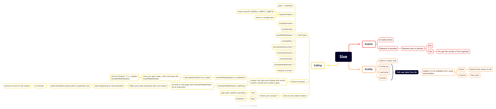

# The College Experience: Year 1

## An app for college students to make friends, and do stuff together rather than alone.

- Six minute calls
  - 3 minutes audio only
    - To prevent the common awkwardness and exclusion of video-first.
  - 3 minutes with video
    - Because physical comedy and knowing who you're talking to are important
- At the end of the call, the users have the choice to exchange socials
  - Both users must agree to exchange socials
- Once you've had your first call, you'll be occasionally prompted to tell all your call peers what you're up to today
  - They can join the activity directly if you've exchanged socials
  - Or request your socials and then join your activity on approval
- The incentive is that users will use the app as a means to grow their sub count and increase their friend count IRL, and consequentially will spend more time making the campus life exciting

## Software architecture

- Frontend: React Native
- Backend: Supabase
- Call infrastructure: Peer.js (react-native-peerjs)
- UI Design software: Figma

### Architecture diagram

